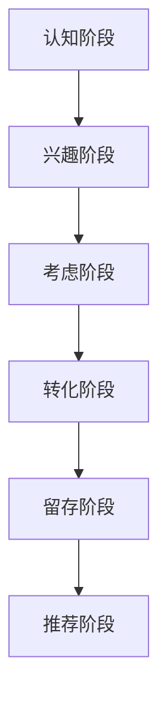

## 营销策略框架

网站营销是一个系统性工程，需要多个渠道和策略的协同配合。本部分将为您提供完整的营销指南。

<Cards>
<Card title="外链建设" href="/docs/marketing/link-building" icon="🔗">
学习如何通过高质量外链提升网站权威性和搜索排名
</Card>

<Card title="内容营销" icon="📝">
（即将推出）创建有价值的内容吸引和转化目标用户
</Card>

<Card title="社交媒体" icon="📱">
（即将推出）利用社交平台扩大品牌影响力
</Card>

<Card title="搜索引擎优化" icon="🔍">
（即将推出）全面的SEO策略和实施指南
</Card>
</Cards>

## 营销核心原则

### 1. 以用户价值为中心
- 深入了解目标用户需求
- 提供真正解决问题的价值
- 建立用户信任和品牌忠诚度

### 2. 数据驱动决策
- 设定可衡量的营销目标
- 持续追踪关键指标
- 基于数据优化策略

### 3. 多渠道整合营销
- 不依赖单一营销渠道
- 实现各渠道协同效应
- 构建完整的用户触达体系

## 营销漏斗模型

每个阶段都需要不同的营销策略和内容类型，确保用户顺利完成转化路径。

## 开始学习

选择您最感兴趣的营销领域开始深入学习：

<Callout type="tip">
**推荐入门**：从[外链建设指南](/docs/marketing/link-building)开始，这是提升网站权威性最直接有效的方法。
</Callout>